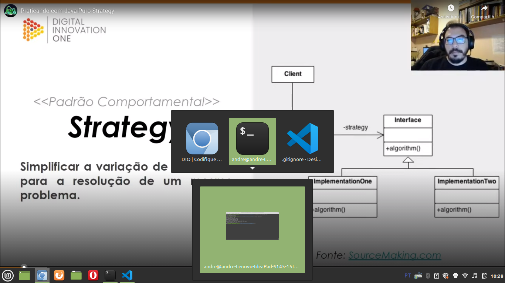
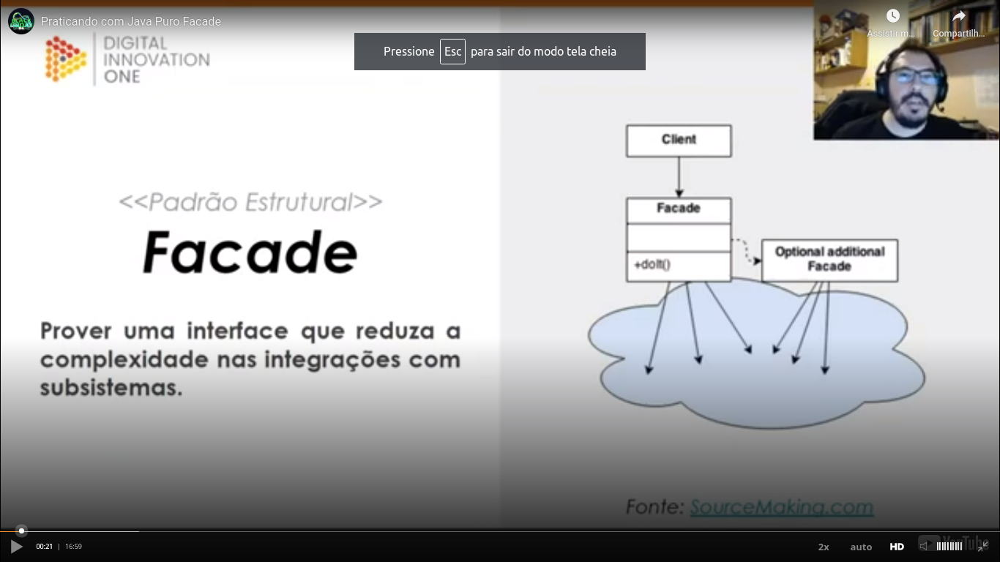

# General

In [this class](https://web.dio.me/lab/explorando-padroes-de-projetos-na-pratica-com-java/learning/dbad4e6b-fc8e-4215-b305-435b0ad652c1) we was learning deveoping a project.

## Groups of design patterns

Teacher teached us that the interface `List` is an example of the application of the `strategy` design pattern.

## Implementations

Please see the implementations in the `src` directory.

### Singleton

Teacher showed us three similar variations of `Singleton` implementations. To more details, please see [this class](https://web.dio.me/lab/explorando-padroes-de-projetos-na-pratica-com-java/learning/fed94247-3cf7-4b04-a9b2-ead7bfd1c51a).

### Strategy

UML diagram:

### Facade

UML diagram:

If you need to understand better this pattern, please watch [the class](https://web.dio.me/lab/explorando-padroes-de-projetos-na-pratica-com-java/learning/b85aef03-dad2-4e21-bbbf-e40aa02a9519?back=/track/coding-the-future-claro-java-spring-boot) and see the examples in the `src` folder.

### Singleton, strategy and facade in Spring Framework

Basic slide:

