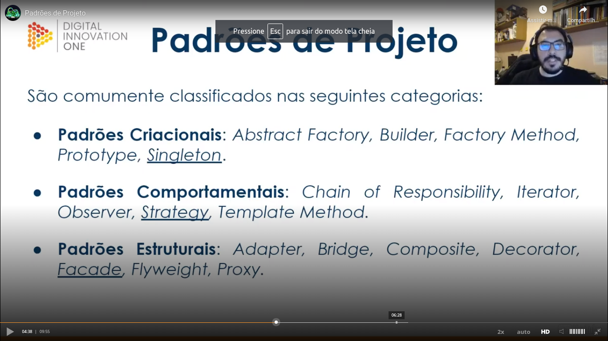

# General

In [this class](https://web.dio.me/lab/explorando-padroes-de-projetos-na-pratica-com-java/learning/dbad4e6b-fc8e-4215-b305-435b0ad652c1) we was learning deveoping a project.

## Groups of design patterns

Teacher teached us that the interface `List` is an example of the application of the `strategy` design pattern.

## Singleton

Teacher showed us three similar variations of `Singleton` implementations. To more details, please see [this class](https://web.dio.me/lab/explorando-padroes-de-projetos-na-pratica-com-java/learning/fed94247-3cf7-4b04-a9b2-ead7bfd1c51a).